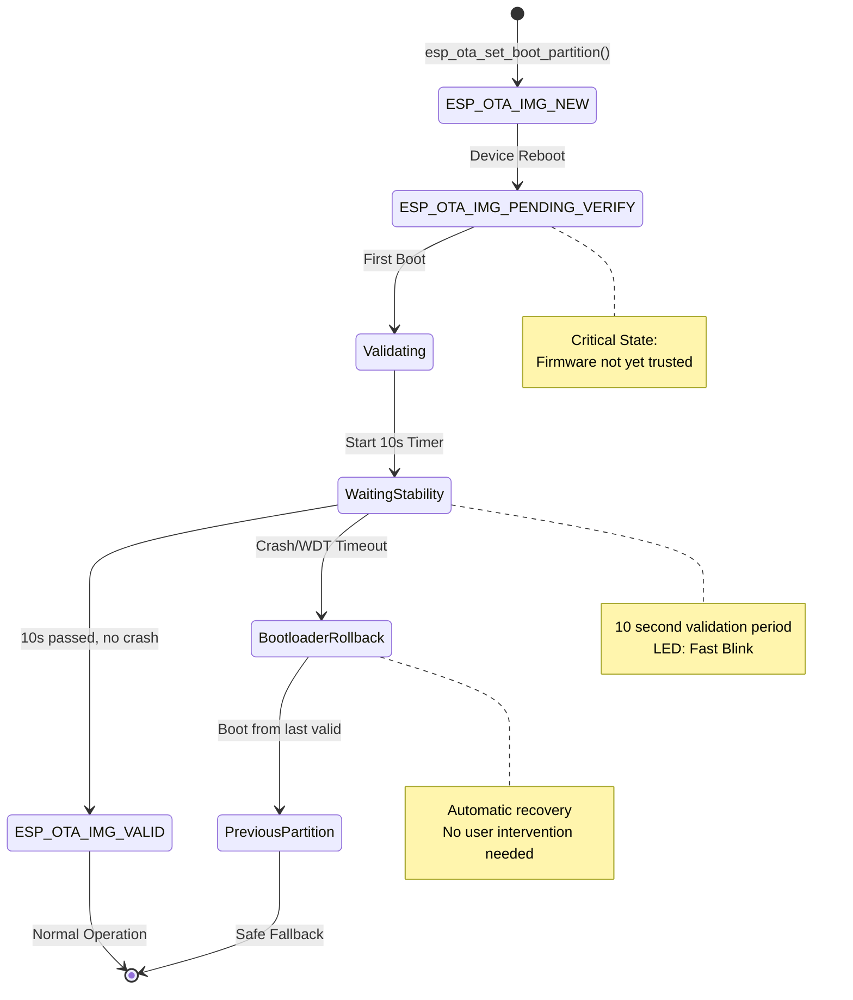
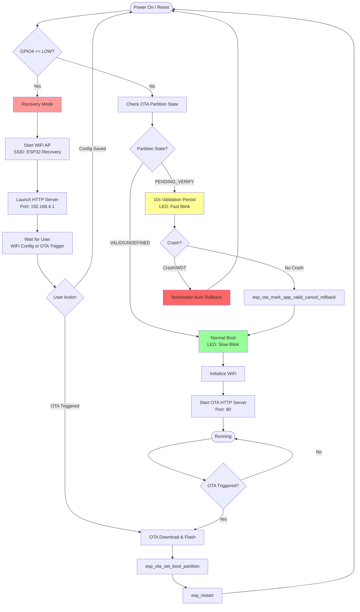
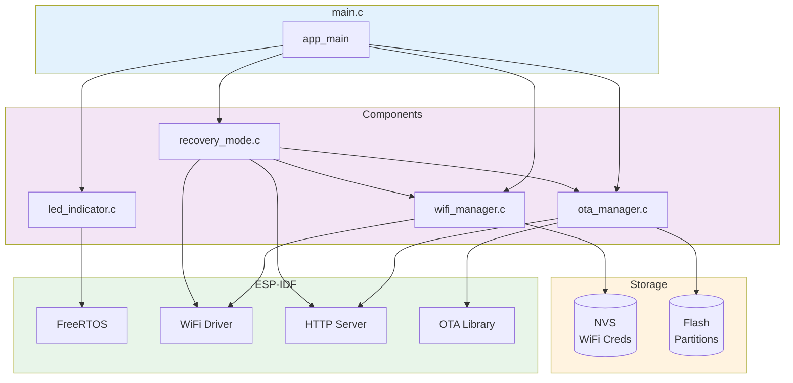
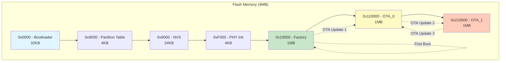
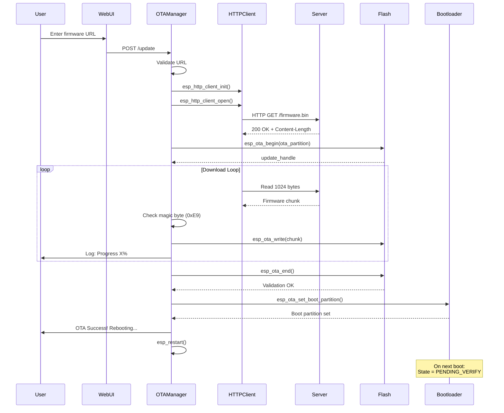
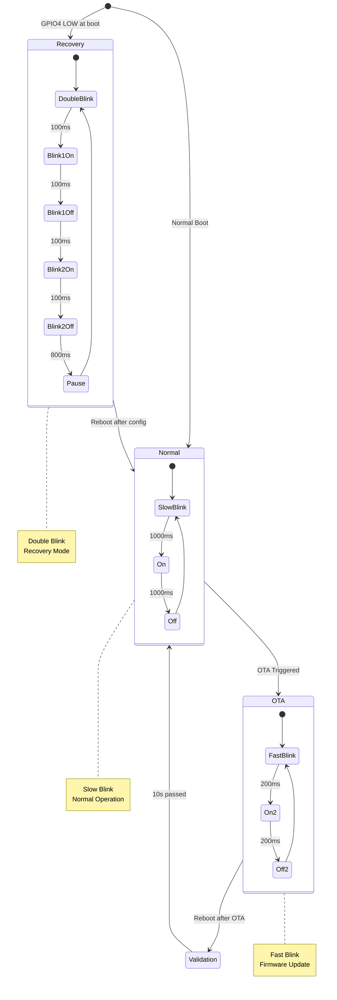

# Architecture Documentation

## System Overview

This document details the technical design decisions, fail-safe mechanisms, and implementation strategies for the ESP32 OTA firmware update system.

## Design Principles

1. **Fail-Safe First**: Every operation considers power-loss scenarios
2. **Atomic State Changes**: Use hardware mechanisms for reliability
3. **Progressive Validation**: Multi-stage verification before trust
4. **Clear State Indicators**: Visual and logging feedback at every stage

---

## Visual Architecture

### OTA State Machine


---

### Boot Flow & Recovery Detection


---

### Component Architecture


---

### Partition Layout


---

## Partition Strategy

### Layout Rationale
```
Factory (1MB):  Initial firmware, fallback for corrupted OTA
OTA_0 (1MB):    Primary update target
OTA_1 (1MB):    Secondary update target (alternating)
NVS (24KB):     WiFi credentials, system state
```

**Why this layout:**
- **Factory partition**: Immutable safety net - always has working firmware
- **Dual OTA**: Alternating updates allow rollback without re-download
- **Oversized partitions**: 1MB each provides headroom for future growth

### Partition Selection Algorithm
```c
const esp_partition_t *update_partition = esp_ota_get_next_update_partition(NULL);
```

ESP-IDF automatically selects:
- If running from `factory` → write to `ota_0`
- If running from `ota_0` → write to `ota_1`
- If running from `ota_1` → write to `ota_0`

---

## OTA Implementation Details

### State Transition Implementation
```c
// In main.c
if (ota_state == ESP_OTA_IMG_PENDING_VERIFY) {
    ESP_LOGI(TAG, "Validating new firmware...");
    led_set_mode(LED_MODE_OTA);
    
    vTaskDelay(pdMS_TO_TICKS(10000));  // 10 second stability test
    
    esp_ota_mark_app_valid_cancel_rollback();
    ESP_LOGI(TAG, "Firmware validated!");
}
```

**Why 10 seconds:**
- Enough time for critical initialization (WiFi, sensors, etc.)
- Short enough to minimize user wait
- Industry standard for embedded validation windows

### OTA Download Sequence


---

### Atomic Operations

**OTA Data Partition (0x9000):**
```c
typedef struct {
    uint32_t ota_seq;      // Monotonic counter
    uint8_t  seq_label[20]; // Partition label
    uint32_t crc;          // Self-integrity check
} esp_ota_select_entry_t;
```

ESP-IDF bootloader uses **double-buffered** OTA data:
1. Writes new entry with incremented `ota_seq`
2. CRC protects against partial writes
3. Bootloader picks highest valid `ota_seq`

**Result:** Power loss during partition switch is safe - bootloader falls back to previous valid entry.

### Flash Write Reliability
```c
err = esp_ota_write(update_handle, buffer, data_read);
```

Internally uses page-level writes:
- Flash controller buffers partial pages
- Only commits full 4KB pages
- Incomplete writes show as 0xFF (erased state)
- ESP-IDF validates with CRC before boot

---

## NVS Usage

### Storage Layout
```
Namespace: "wifi_config"
├─ ssid (string, max 32 bytes)
└─ password (string, max 64 bytes)

Namespace: "ota_data" (ESP-IDF managed)
└─ OTA state machine data
```

### Write Strategy
```c
nvs_handle_t handle;
nvs_open("wifi_config", NVS_READWRITE, &handle);
nvs_set_str(handle, "ssid", ssid);
nvs_set_str(handle, "password", password);
nvs_commit(handle);  // ← Atomic commit
nvs_close(handle);
```

**`nvs_commit()` guarantees:**
- All writes in transaction are atomic
- CRC-protected
- Wear-leveling across flash sectors
- Power-loss safe (commits entire page or nothing)

---


### Boot Detection
```c
gpio_set_pull_mode(BOOT_GPIO, GPIO_PULLUP_ONLY);
vTaskDelay(pdMS_TO_TICKS(100));  // Debounce

if (gpio_get_level(BOOT_GPIO) == 0) {
    // GPIO LOW → Recovery mode
}
```

**Timing:**
- GPIO read happens ~100ms after reset
- User must hold button through reset
- Internal pull-up ensures defined state

### WiFi AP Configuration
```c
wifi_config_t ap_config = {
    .ap = {
        .ssid = "ESP32-Recovery",
        .password = "recovery123",
        .max_connection = 4,
        .authmode = WIFI_AUTH_WPA2_PSK
    }
};
```

**Security considerations:**
- WPA2-PSK for production (changeable in code)
- Limited connections to prevent DoS
- No internet access (isolated AP)

### HTTP Server

Lightweight server using ESP-IDF httpd:
```c
httpd_config_t config = HTTPD_DEFAULT_CONFIG();
config.max_uri_handlers = 8;
config.stack_size = 4096;
```

**Memory footprint:** ~30KB RAM

---

## OTA Download Implementation

### Why Not `esp_https_ota()`?

Assessment requires custom implementation to demonstrate understanding. Using low-level API:
```c
esp_http_client_handle_t client = esp_http_client_init(&config);
esp_http_client_open(client, 0);

esp_ota_begin(partition, OTA_SIZE_UNKNOWN, &handle);

while (data_read > 0) {
    data_read = esp_http_client_read(client, buffer, 1024);
    esp_ota_write(handle, buffer, data_read);
}

esp_ota_end(handle);
esp_ota_set_boot_partition(partition);
```

**Advantages:**
- Custom header parsing (for `prepare-firmware.py` output)
- Progress callbacks
- Retry logic
- Timeout handling

### Header Detection
```c
uint32_t magic = *((uint32_t *)buffer);
if (magic == 0xDEADBEEF) {
    // Custom header - skip 44 bytes
    firmware_offset = 44;
} else if (buffer[0] == 0xE9) {
    // Raw ESP32 binary - write as-is
    firmware_offset = 0;
}
```

Supports both:
- Prepared firmware (with metadata)
- Raw binaries (direct from build)

---

## LED Indicator Design

### LED State Machine


### Implementation
```c
typedef enum {
    LED_MODE_NORMAL,    // 1000ms on, 1000ms off
    LED_MODE_OTA,       // 200ms on, 200ms off
    LED_MODE_RECOVERY   // 100ms-100ms-100ms-100ms-800ms
} led_mode_t;

static void led_task(void *pvParameters) {
    while (1) {
        switch (current_mode) {
            case LED_MODE_RECOVERY:
                for (int i = 0; i < 2; i++) {
                    gpio_set_level(LED_GPIO, 1);
                    vTaskDelay(pdMS_TO_TICKS(100));
                    gpio_set_level(LED_GPIO, 0);
                    vTaskDelay(pdMS_TO_TICKS(100));
                }
                vTaskDelay(pdMS_TO_TICKS(800));
                break;
            // ... other modes
        }
    }
}
```

Dedicated FreeRTOS task ensures non-blocking operation.

---

## Memory Management

### Flash Usage

| Component | Size | Notes |
|-----------|------|-------|
| Bootloader | 32KB | ESP-IDF default |
| Partition Table | 4KB | |
| NVS | 24KB | WiFi + system state |
| PHY Init | 4KB | RF calibration |
| Factory App | ~900KB | |
| OTA Partitions | 1MB each | Growth headroom |
| **Total** | ~3MB | 4MB flash recommended |

### RAM Usage (Estimated)

| Component | Heap | Stack | Total |
|-----------|------|-------|-------|
| FreeRTOS Kernel | 10KB | - | 10KB |
| WiFi Stack | 40KB | 8KB | 48KB |
| HTTP Server | 20KB | 4KB | 24KB |
| Application | 15KB | 8KB | 23KB |
| **Available** | ~130KB | - | ~130KB |
| **Total (ESP32)** | ~280KB DRAM | ~320KB SRAM |

Plenty of headroom for additional features.

---

## Security Considerations

### Current Implementation

- SHA256 integrity check (via `prepare-firmware.py`)
- WPA2-PSK for recovery AP
- HTTP (unencrypted) for OTA

### Integration Tests

1. **Happy Path**: Normal OTA update
2. **Network Failure**: Mid-download disconnect
3. **Power Loss Simulation**: Reset during flash write
4. **Crash Test**: Firmware with intentional crash
5. **Recovery Mode**: Full workflow test

---

## Performance Metrics

| Operation | Duration | Notes |
|-----------|----------|-------|
| Boot Time | ~2s | Factory partition |
| WiFi Connect | 3-5s | Depends on AP |
| OTA Download | ~30s | 900KB @ 256kbps |
| Flash Write | ~15s | Including verification |
| Validation Period | 10s | Mandatory |
| **Total OTA** | **~60s** | From trigger to validated boot |

---

## Future Improvements

1. **Delta Updates**: Binary diff to reduce download size
2. **Compressed Firmware**: gzip compression (ESP32 hardware decompression)
3. **A/B Testing**: Deploy to subset of devices
4. **Remote Monitoring**: MQTT telemetry for OTA status
5. **Batch Updates**: Scheduled deployment windows

---

## References

- [ESP-IDF OTA Documentation](https://docs.espressif.com/projects/esp-idf/en/latest/esp32/api-reference/system/ota.html)
- [ESP32 Flash Encryption](https://docs.espressif.com/projects/esp-idf/en/latest/esp32/security/flash-encryption.html)
- [Secure Boot V2](https://docs.espressif.com/projects/esp-idf/en/latest/esp32/security/secure-boot-v2.html)
- [Mermaid Diagram Syntax](https://mermaid.js.org/)
